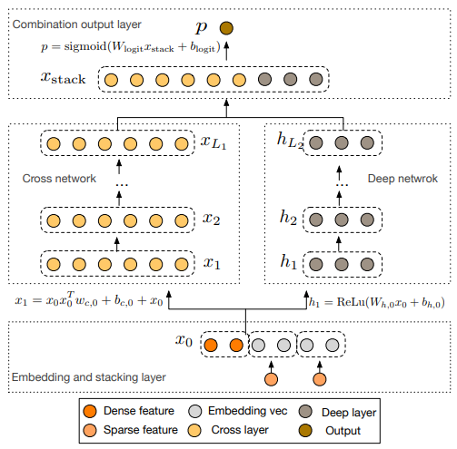

# DeepAndCrossNetwork-TF

This is a TensorFlow implementation of Deep & Cross Network for CTR prediction task, as described in the paper:

Ruoxi Wang, Bin Fu, Gang Fu, Mingliang Wang. Deep & Cross Network for Ad Click Predictions.

## Structure

  

## Reference

__Very thanks to__:

- https://github.com/ChenglongChen/tensorflow-DeepFM
- Deep & Cross Network for Ad Click Predictions, Ruoxi Wang, Bin Fu, Gang Fu, Mingliang Wang.

### ToDoList
- Remove useless code.
